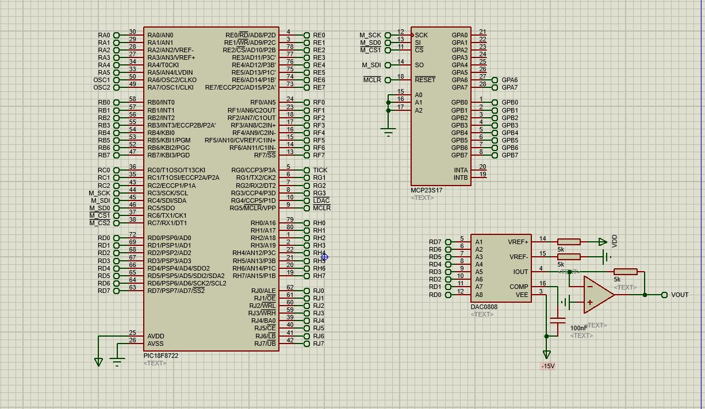
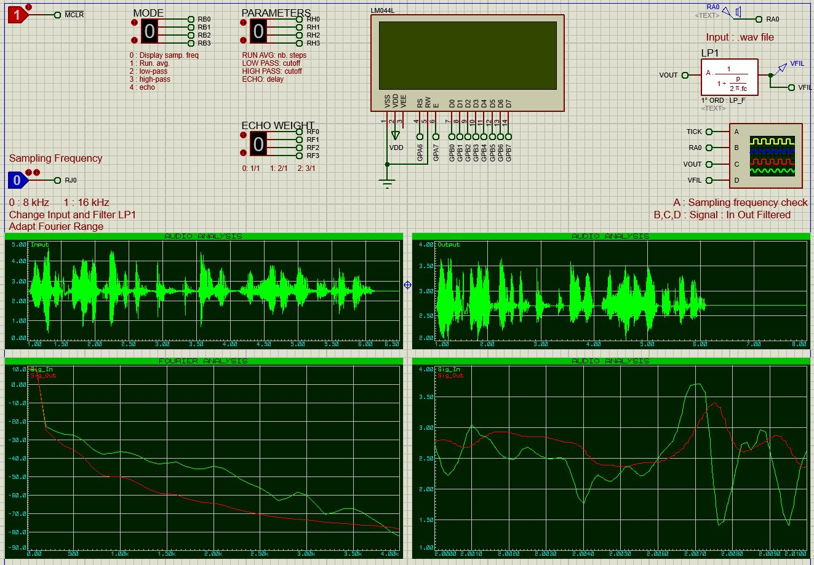

# Audio Signal Processing
Audio signal filters and simple effects in C

This school project allows to process an input analog signal applying running average filter, low pass filter, high pass filter and echo effect.

## Components 
* Microcontroller PIC18F8722
* Digital-to-Analog Converter DAC0808
* LCD 20x4 LM044L
* I/O Expander 16 bits MCP23S17

## Environment
* MPLABX v5.40
* Proteus 8

### Example

